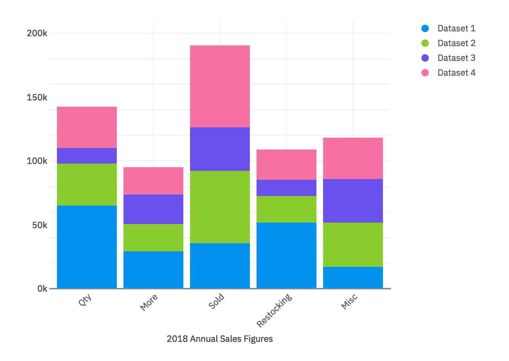

<p align="center">
	<a href="https://pages.github.ibm.com/peretz/charts/">
		
	</a>
	<h3 align="center">Peretz Charts</h3>
	<p align="center">
		A reusable framework-agnostic D3 charting library for Watson Customer Engagement.
	</p>
</p>

## Table of contents

- [Component status](#component-status)
- [Installation](#installation)
- [Demo and documentation](#demo-and-documentation)
- [Code Sample](#code-sample)
- [Run Charts locally](#run-charts-locally)
- [Bugs and feature requests](#bugs-and-feature-requests)
- [Contributing](#contributing)
- [Community](#community)
- [Versioning](#versioning)
- [Copyright and license](#copyright-and-license)

## Component status
:white_check_mark: Stable :hourglass_flowing_sand: In progress

| Component   | Vanilla            | Angular                  | React |
|-------------|--------------------|--------------------------|-------|
| Simple Bar  | :white_check_mark: | :hourglass_flowing_sand: | Soon  |
| Grouped Bar | :white_check_mark: | :hourglass_flowing_sand: | Soon  |
| Stacked Bar | :white_check_mark: | :hourglass_flowing_sand: | Soon  |
| Donut       | :white_check_mark: | :hourglass_flowing_sand: | Soon  |
| Line        | :white_check_mark: | :hourglass_flowing_sand: | Soon  |
| Curved Line | :white_check_mark: | :hourglass_flowing_sand: | Soon  |
| Pie         | :white_check_mark: | :hourglass_flowing_sand: | Soon  |
| Step        | :white_check_mark: | :hourglass_flowing_sand: | Soon  |
| Area        | Soon               | Soon                     | Soon  |

## Getting started

### Installation

First, log in to the whitewater hosted NPM Enterprise by initiating authentication like this:

  ```bash
  $ npm login --registry=https://npm-registry.whitewater.ibm.com --scope=@peretz --auth-type=oauth
  ```

_Refer to [this guide](https://github.ibm.com/Whitewater/npm-enterprise) for further instructions._

After authentication, run `npm install @peretz/charts` to download the latest Charts distribution package.

## Demo and documentation

Charts' demo and documentation can be viewed in [GitHub Pages](https://github.ibm.com/peretz/charts/tree/gh-pages) at <https://pages.github.ibm.com/peretz/charts/> and <https://pages.github.ibm.com/peretz/charts/documentation/> respectively.

### Code Sample
<p align="center">
	
</p>

HTML:
```html
<div id="stacked-bar-chart-holder"></div>
```

JS:
```js
import { BarChart } from "@peretz/charts/bundle/bundle.js";

const colors = [
	"#009BEF",
	"#95D13C",
	"#785EF0",
	"#F87EAC",
	"#FFB000",
	"#00B6CB",
	"#FF5C49",
	"#047CC0",
	"#FE8500",
	"#5A3EC8",
	"#40D5BB",
	"#FF509E"
];

const stackedBarData = {
	labels: ["Qty", "More", "Sold", "Restocking", "Misc"],
	datasets: [
		{
			label: "Dataset 1",
			backgroundColors: [colors[0]],
			data: [
				65000,
				29123,
				35213,
				51213,
				16932
			]
		},
		{
			label: "Dataset 2",
			backgroundColors: [colors[1]],
			data: [
				32432,
				21312,
				56456,
				21312,
				34234
			]
		},
		{
			label: "Dataset 3",
			backgroundColors: [colors[2]],
			data: [
				12312,
				23232,
				34232,
				12312,
				34234
			]
		}
	]
};

const stackedBarOptions = {
	accessibility: false,
	scales: {
		x: {
			title: "2018 Annual Sales Figures",
		},
		y: {
			formatter: axisValue => {
				return `${axisValue / 1000}k`;
			},
			yMaxAdjuster: yMaxValue => yMaxValue * 1.1,
			stacked: true
		}
	},
	legendClickable: true,
	containerResizable: true,
};

// Grab chart holder HTML element and initialize the chart
const chartHolder = document.getElementById("stacked-bar-chart-holder");
const barChart = new BarChart(
	chartHolder,
	{
		data: stackedBarData,
		options: stackedBarOptions,
	}
);
```

### Run Charts locally

Environment prereqs: [GHE](https://github.ibm.com/peretz), [NPM Enterprise](https://github.ibm.com/Whitewater/npm-enterprise), [Git](https://git-scm.com/downloads), and [Node.js](https://nodejs.org/en/download/).

1. Fork the project and clone your fork:

   ```bash
   # Clone your fork of the repo into the current directory
   git clone git@github.ibm.com:<your-username>/charts.git
   # Navigate to the newly cloned directory
   cd charts
   ```

2. Run `npm install` to install Node.js dependencies.
3. Run `npm run demo:server` to serve up the demo locally.
4. Finally, open <http://localhost:9090/> in your browser. SPOILER ALERT: There's no "Hello, World!"

## Bugs and feature requests

Have a bug or a feature request? First read the [issue guidelines](https://github.ibm.com/peretz/charts/blob/master/CONTRIBUTING.md#issue-guidelines) and search for existing and closed issues. If your problem or idea is not addressed yet, [open a new issue](https://github.ibm.com/peretz/charts/issues/new).

## Contributing

See our [contributing guidelines](https://github.ibm.com/peretz/charts/blob/master/CONTRIBUTING.md). Included are instructions for opening issues, coding guidelines, and submitting pull requests.

## Community

Get updates on Charts' development and chat with the core team and community.

- Bookmark the [WCE Showcase](http://peretz.stage1.mybluemix.net/) in your favorite browser.
- Join our very own [Slack room](https://peretz.slack.com/).
- Subscribe to our quarterly Community Calls by contacting [Nina Li](https://github.ibm.com/nina).

## Versioning

It is important to know we do our best to ensure Charts adheres to the [Semantic Versioning guidelines](http://semver.org/).

See our [releases notes](https://github.ibm.com/peretz/charts/releases) for the changelog of each version of Charts. Releases are announced at our Community Calls and posted in [Charts' slack channel](https://peretz.slack.com/messages/peretz-charts/).

## Copyright and license

© Copyright IBM Corp. 2014, 2018
