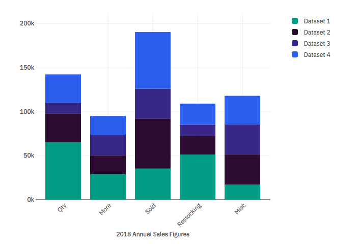

<p align="center">
	<a href="https://pages.github.com/IBM/carbon-charts/">
		
	</a>
	<h3 align="center">Carbon Charts</h3>
	<p align="center">
		A reusable framework-agnostic D3 charting library.
		<br /><br />
		<a href="https://travis-ci.org/IBM/carbon-charts/">
			
		</a>
		<a href="https://www.npmjs.com/package/@carbon/charts">
			
		</a>
		
	</p>
	<p align="center">
		:bar_chart: :chart_with_upwards_trend: :rocket:
	</p>
</p>

## Table of contents

- [Component status](#component-status)
- [Installation](#installation)
- [Demo and documentation](#demo-and-documentation)
- [Code Sample](#code-sample)
- [Run Charts locally](#run-charts-locally)
- [Bugs and feature requests](#bugs-and-feature-requests)
- [Contributing](#contributing)
- [Community](#community)
- [Versioning](#versioning)
- [Copyright and license](#copyright-and-license)

## Component status
:white_check_mark: Stable :hourglass_flowing_sand: In progress

| Component   | Vanilla            | Angular                  | React |
|-------------|--------------------|--------------------------|-------|
| Simple Bar  | :white_check_mark: | :white_check_mark:       | Soon  |
| Grouped Bar | :white_check_mark: | :white_check_mark:       | Soon  |
| Stacked Bar | :white_check_mark: | :white_check_mark:       | Soon  |
| Donut       | :white_check_mark: | :white_check_mark:       | Soon  |
| Line        | :white_check_mark: | :white_check_mark:       | Soon  |
| Curved Line | :white_check_mark: | :white_check_mark:       | Soon  |
| Pie         | :white_check_mark: | :white_check_mark:       | Soon  |
| Step        | :white_check_mark: | :white_check_mark:       | Soon  |
| Combo       | Soon               | Soon                     | Soon  |
| Area        | Soon               | Soon                     | Soon  |

## Getting started

### Installation

Run:
```bash
npm i -g @storybook/cli

npm install @carbon/charts --save
```

## Demo and documentation

Charts' demo and documentation can be viewed in [GitHub Pages](https://pages.github.com/IBM/carbon-charts/) at <https://pages.github.com/IBM/carbon-charts/> and <https://pages.github.com/IBM/carbon-charts/documentation/> respectively.

### Code Sample
<p align="center">
	
</p>

HTML:
```html
<div id="stacked-bar-chart-holder"></div>
```

JS:
```js
import { BarChart } from "@carbon/charts";

const colors = [
	"#00a68f",
	"#3b1a40",
	"#473793",
	"#3c6df0",
	"#56D2BB"
];

const stackedBarData = {
	labels: ["Qty", "More", "Sold", "Restocking", "Misc"],
	datasets: [
		{
			label: "Dataset 1",
			backgroundColors: [colors[0]],
			data: [
				65000,
				29123,
				35213,
				51213,
				16932
			]
		},
		{
			label: "Dataset 2",
			backgroundColors: [colors[1]],
			data: [
				32432,
				21312,
				56456,
				21312,
				34234
			]
		},
		{
			label: "Dataset 3",
			backgroundColors: [colors[2]],
			data: [
				12312,
				23232,
				34232,
				12312,
				34234
			]
		}
	]
};

const stackedBarOptions = {
	accessibility: false,
	scales: {
		x: {
			title: "2018 Annual Sales Figures",
		},
		y: {
			formatter: axisValue => {
				return `${axisValue / 1000}k`;
			},
			yMaxAdjuster: yMaxValue => yMaxValue * 1.1,
			stacked: true
		}
	},
	legendClickable: true,
	containerResizable: true,
};

// Grab chart holder HTML element and initialize the chart
const chartHolder = document.getElementById("stacked-bar-chart-holder");
const barChart = new BarChart(
	chartHolder,
	{
		data: stackedBarData,
		options: stackedBarOptions,
	}
);
```

### Run Charts locally
1. Fork the project and clone your fork:

   ```bash
   # Clone your fork of the repo into the current directory
   git clone git@github.com:<your-username>/carbon-charts.git
   # Navigate to the newly cloned directory
   cd carbon-charts
   ```

2. Run `npm install` to install Node.js dependencies.
3. Run `npm run demo:server` to serve up the demo locally.
4. Finally, open <http://localhost:9001/> in your browser. SPOILER ALERT: There's no "Hello, World!"

## Bugs and feature requests

Have a bug or a feature request? First read the [issue guidelines](https://github.com/IBM/carbon-charts/blob/master/CONTRIBUTING.md#issue-guidelines) and search for existing and closed issues. If your problem or idea is not addressed yet, [open a new issue](https://github.com/IBM/carbon-charts/issues/new).

## Contributing

See our [contributing guidelines](https://github.com/IBM/carbon-charts/blob/master/CONTRIBUTING.md). Included are instructions for opening issues, coding guidelines, and submitting pull requests.

<!-- ## Community

Get updates on Charts' development and chat with the core team and community. -->

## Versioning

We use the **semantic-release** library to automatically version our releases within the guidelines of Semantic Versioning [Semantic Versioning guidelines](http://semver.org/).

See our [releases notes](https://github.com/IBM/carbon-charts/releases) for the changelog of each version of Charts.
