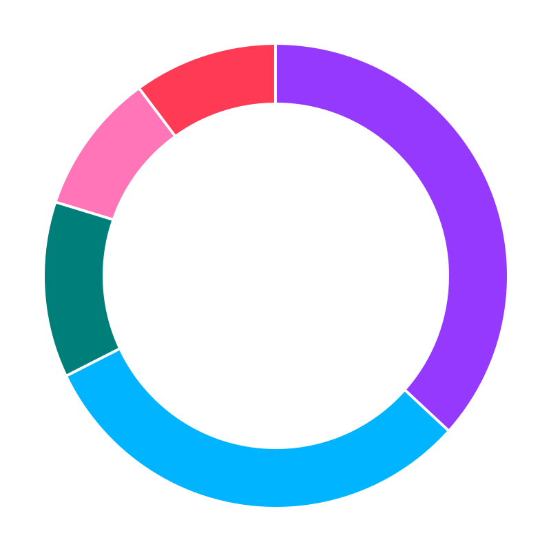
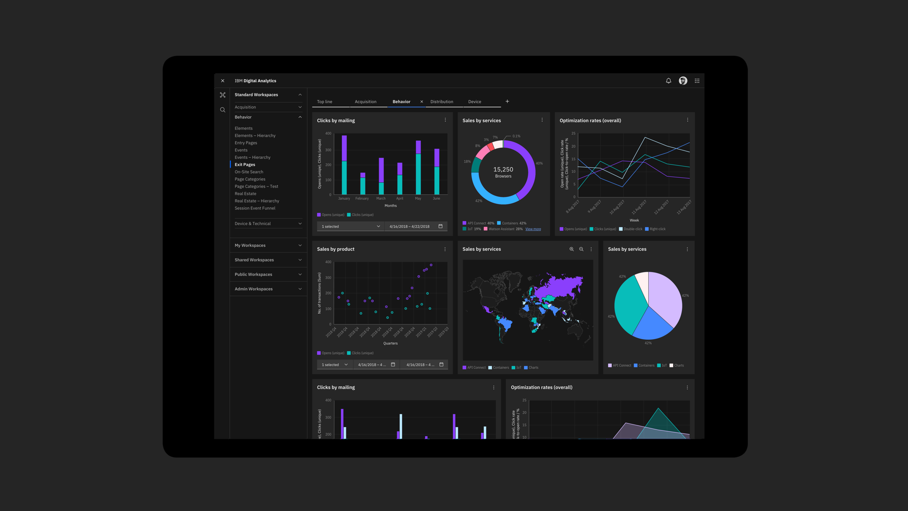

	
	<h3 align="center">Carbon Charts</h3>
	

		A reusable framework-agnostic D3 charting library.
		  
		
		
		
	

## Packages
- [Vanilla](./packages/core)
- [React](./packages/react)
- [Angular](./packages/angular)
- [Vue](./packages/vue)
- [Svelte](./packages/svelte)

## Design specifications

Carbon data visualization design specifications can be found [here](https://www.carbondesignsystem.com/data-visualization/getting-started).

## CHANGELOG
Read the release change logs [here](https://github.com/carbon-design-system/carbon-charts/releases)

## Component status
:white_check_mark: Stable :hourglass_flowing_sand: In progress

| Component   | Vanilla            | Angular                  | React | Vue | Svelte |
|-------------|--------------------|--------------------------|-------|-------| --- |
| Simple Bar  | :white_check_mark: | :white_check_mark: | :white_check_mark: | :white_check_mark: | :white_check_mark:
| Grouped Bar | :white_check_mark: | :white_check_mark: | :white_check_mark: | :white_check_mark: | :white_check_mark:
| Stacked Bar | :white_check_mark: | :white_check_mark: | :white_check_mark: | :white_check_mark: | :white_check_mark:
| Floating Bar| :white_check_mark: | :white_check_mark: | :white_check_mark: | :white_check_mark: | :white_check_mark:
| Donut       | :white_check_mark: | :white_check_mark: | :white_check_mark: | :white_check_mark: | :white_check_mark:
| Line        | :white_check_mark: | :white_check_mark: | :white_check_mark: | :white_check_mark: | :white_check_mark:
| Curved Line | :white_check_mark: | :white_check_mark: | :white_check_mark: | :white_check_mark: | :white_check_mark:
| Pie         | :white_check_mark: | :white_check_mark: | :white_check_mark: | :white_check_mark: | :white_check_mark:
| Step        | :white_check_mark: | :white_check_mark: | :white_check_mark: | :white_check_mark: | :white_check_mark:
| Scatter     | :white_check_mark: | :white_check_mark: | :white_check_mark: | :white_check_mark: | :white_check_mark:
| Radar       | :white_check_mark: | :white_check_mark: | :white_check_mark: | :white_check_mark: | :white_check_mark:
| Area        | :white_check_mark: | :white_check_mark: | :white_check_mark: | :white_check_mark: | :white_check_mark:
| Gauge       | :white_check_mark: | :white_check_mark: | :white_check_mark: | :white_check_mark: | :white_check_mark:
| Meter       | :white_check_mark: | :white_check_mark: | :white_check_mark: | :white_check_mark: | :white_check_mark:
| Sparkline   | :white_check_mark: | :white_check_mark: | :white_check_mark: | :white_check_mark: | :white_check_mark:
| Treemap     | :white_check_mark: | :white_check_mark: | :white_check_mark: | :white_check_mark: | :white_check_mark:
| Combo       | :white_check_mark: | :white_check_mark: | :white_check_mark: | :white_check_mark: | :white_check_mark:
| Wordcloud     | :white_check_mark: | :white_check_mark: | :white_check_mark: | :white_check_mark: | :white_check_mark:
| Bullet     | :white_check_mark: | :white_check_mark: | :white_check_mark: | :white_check_mark: | :white_check_mark:
| Circle Pack     | :white_check_mark: | :white_check_mark: | :white_check_mark: | :white_check_mark: | :white_check_mark: |
| Network diagrams     | — | :white_check_mark: | :white_check_mark: | — | — |

## Bugs and feature requests

Have a bug or a feature request? First read the [issue guidelines](https://github.com/carbon-design-system/carbon-charts/blob/master/CONTRIBUTING.md#issue-guidelines) and search for existing and closed issues. If your problem or idea is not addressed yet, [open a new issue](https://github.com/carbon-design-system/carbon-charts/issues/new).

## Contributing

See our [contributing guidelines](https://github.com/carbon-design-system/carbon-charts/blob/master/CONTRIBUTING.md). Included are instructions for opening issues, coding guidelines, and submitting pull requests.

<!-- ## Community

Get updates on Charts' development and chat with the core team and community. -->

## Versioning

We use the **semantic-release** library to automatically version our releases within the guidelines of Semantic Versioning [Semantic Versioning guidelines](http://semver.org/).

See our [release change logs](https://github.com/carbon-design-system/carbon-charts/blob/master/CHANGELOG.md) for the changelog of each version of Charts.

## Core Team
<!-- ALL-CONTRIBUTORS-LIST:START - Do not remove or modify this section -->
<!-- prettier-ignore -->
<table>
  <tr>
    <td align="center"><a href="http://eMoosavi.com"> <b>Eliad Moosavi</b></a> <a href="https://github.com/carbon-design-system/carbon-charts/commits?author=theiliad" title="Code">💻</a> <a href="https://github.com/carbon-design-system/carbon-charts/commits?author=theiliad" title="Documentation">📖</a> <a href="#example-theiliad" title="Examples">💡</a> <a href="#infra-theiliad" title="Infrastructure (Hosting, Build-Tools, etc)">🚇</a></td>
	<td align="center"><a href="https://github.com/natashadecoste"> <b>natashadecoste</b></a> <a href="https://github.com/carbon-design-system/carbon-charts/commits?author=natashadecoste" title="Code">💻</a> <a href="https://github.com/carbon-design-system/carbon-charts/commits?author=natashadecoste" title="Documentation">📖</a> <a href="#example-natashadecoste" title="Examples">💡</a></td>
    <td align="center"><a href="http://www.zvonimirfras.com"> <b>Zvonimir Fras</b></a> <a href="https://github.com/carbon-design-system/carbon-charts/commits?author=zvonimirfras" title="Code">💻</a> <a href="https://github.com/carbon-design-system/carbon-charts/commits?author=zvonimirfras" title="Documentation">📖</a> <a href="#review-zvonimirfras" title="Reviewed Pull Requests">👀</a></td>
    <td align="center"><a href="http://reallyawesomedomain.com"> <b>Callum Smith</b></a> <a href="https://github.com/carbon-design-system/carbon-charts/commits?author=cal-smith" title="Code">💻</a> <a href="https://github.com/carbon-design-system/carbon-charts/commits?author=cal-smith" title="Documentation">📖</a> <a href="#review-cal-smith" title="Reviewed Pull Requests">👀</a></td>
  </tr>
</table>

<!-- ALL-CONTRIBUTORS-LIST:END -->

## Contributors
<!-- ALL-CONTRIBUTORS-LIST:START - Do not remove or modify this section -->
<!-- prettier-ignore -->
<table>
  <tr>
    <td align="center"><a href="https://github.com/shixiedesign"> <b>shixiedesign</b></a> <a href="#design-shixiedesign" title="Design">🎨</a></td>
	<td align="center"><a href="https://github.com/cameroncalder"> <b>cameroncalder</b></a> <a href="#design-cameroncalder" title="Design">🎨</a></td>
    <td align="center"><a href="https://github.com/dianatran18"> <b>Diana Tran</b></a> <a href="#design-dianatran18" title="Design">🎨</a> <a href="https://github.com/carbon-design-system/carbon-charts/commits?author=dianatran18" title="Documentation">📖</a></td>
	<td align="center"><a href="https://github.com/nicoleroppel"> <b>nicoleroppel</b></a> <a href="#design-nicoleroppel" title="Design">🎨</a> <a href="https://github.com/carbon-design-system/carbon-charts/commits?author=nicoleroppel" title="Documentation">📖</a></td>
  </tr>
  <tr>
	<td align="center"><a href="https://github.com/scottdickerson"> <b>scottdickerson</b></a>  <a href="https://github.com/carbon-design-system/carbon-charts/commits?author=scottdickerson" title="Code">💻</a></td>
	<td align="center"><a href="https://github.com/ZrianinaMariia"> <b>ZrianinaMariia</b></a>  <a href="https://github.com/carbon-design-system/carbon-charts/commits?author=ZrianinaMariia" title="Code">💻</a></td>
	<td align="center"><a href="https://github.com/moores2"> <b>moores2</b></a>  <a href="https://github.com/carbon-design-system/carbon-charts/commits?author=moores2" title="Code">💻</a></td>
    <td align="center"><a href="https://github.com/stanislavgeorgiev"> <b>stanislavgeorgiev</b></a>  <a href="https://github.com/carbon-design-system/carbon-charts/commits?author=stanislavgeorgiev" title="Code">💻</a></td>
  </tr>
  <tr>
	<td align="center"><a href="https://github.com/jendowns"> <b>jendowns</b></a>  <a href="https://github.com/carbon-design-system/carbon-charts/commits?author=jendowns" title="Code">💻</a></td>
    <td align="center"><a href="https://github.com/t-mullen"> <b>Thomas Mullen</b></a> <a href="https://github.com/carbon-design-system/carbon-charts/commits?author=t-mullen" title="Code">💻</a></td>
    <td align="center"><a href="https://github.com/JaimeMae"> <b>Jaime Stockton</b></a> <a href="#design-JaimeMae" title="Design">🎨</a> <a href="https://github.com/carbon-design-system/carbon-charts/commits?author=JaimeMae" title="Documentation">📖</a></td>
    <td align="center"><a href="https://github.com/PLopezD"> <b>Pablo Lopez Domowicz</b></a> <a href="#design-PLopezD" title="Design">🎨</a> <a href="https://github.com/carbon-design-system/carbon-charts/commits?author=PLopezD" title="Documentation">📖</a></td>
  </tr>
  <tr>
    <td align="center"><a href="http://www.johnpeng47.com"> <b>John Peng</b></a> <a href="https://github.com/carbon-design-system/carbon-charts/commits?author=JohnPeng47" title="Code">💻</a></td>
  </tr>
</table>

<!-- ALL-CONTRIBUTORS-LIST:END -->

## Code of Conduct
Read our code of conduct [here](./CODE_OF_CONDUCT.md)
