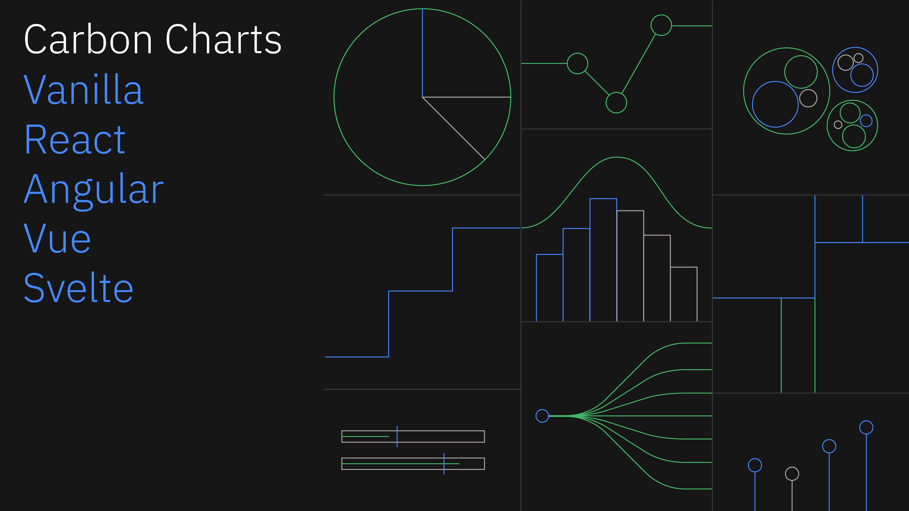

	
	<h3 align="center">Carbon Charts</h3>
	

		A reusable framework-agnostic D3 charting library.
		  
		
		
		
		
	

## Packages

- [Vanilla JavaScript](./packages/core)
- [React](./packages/react)
- [Angular](./packages/angular)
- [Svelte](./packages/svelte)
- [Vue](./packages/vue)

## Demos

Visit [the demo website](https://charts.carbondesignsystem.com/?path=/story/docs--welcome)

## Design specifications

Carbon data visualization design specifications can be found
[here](https://www.carbondesignsystem.com/data-visualization/getting-started).

## CHANGELOG

Read the release change logs [here](https://github.com/carbon-design-system/carbon-charts/releases)

## Component status

:white_check_mark: Stable :hourglass_flowing_sand: In progress

| Component            | Vanilla                  | Angular                  | React                    | Vue                      | Svelte                   |
| -------------------- | ------------------------ | ------------------------ | ------------------------ | ------------------------ | ------------------------ |
| Simple Bar           | :white_check_mark:       | :white_check_mark:       | :white_check_mark:       | :white_check_mark:       | :white_check_mark:       |
| Grouped Bar          | :white_check_mark:       | :white_check_mark:       | :white_check_mark:       | :white_check_mark:       | :white_check_mark:       |
| Stacked Bar          | :white_check_mark:       | :white_check_mark:       | :white_check_mark:       | :white_check_mark:       | :white_check_mark:       |
| Floating Bar         | :white_check_mark:       | :white_check_mark:       | :white_check_mark:       | :white_check_mark:       | :white_check_mark:       |
| Donut                | :white_check_mark:       | :white_check_mark:       | :white_check_mark:       | :white_check_mark:       | :white_check_mark:       |
| Line                 | :white_check_mark:       | :white_check_mark:       | :white_check_mark:       | :white_check_mark:       | :white_check_mark:       |
| Curved Line          | :white_check_mark:       | :white_check_mark:       | :white_check_mark:       | :white_check_mark:       | :white_check_mark:       |
| Pie                  | :white_check_mark:       | :white_check_mark:       | :white_check_mark:       | :white_check_mark:       | :white_check_mark:       |
| Step                 | :white_check_mark:       | :white_check_mark:       | :white_check_mark:       | :white_check_mark:       | :white_check_mark:       |
| Scatter              | :white_check_mark:       | :white_check_mark:       | :white_check_mark:       | :white_check_mark:       | :white_check_mark:       |
| Radar                | :white_check_mark:       | :white_check_mark:       | :white_check_mark:       | :white_check_mark:       | :white_check_mark:       |
| Area                 | :white_check_mark:       | :white_check_mark:       | :white_check_mark:       | :white_check_mark:       | :white_check_mark:       |
| Gauge                | :white_check_mark:       | :white_check_mark:       | :white_check_mark:       | :white_check_mark:       | :white_check_mark:       |
| Meter                | :white_check_mark:       | :white_check_mark:       | :white_check_mark:       | :white_check_mark:       | :white_check_mark:       |
| Sparkline            | :white_check_mark:       | :white_check_mark:       | :white_check_mark:       | :white_check_mark:       | :white_check_mark:       |
| Treemap              | :white_check_mark:       | :white_check_mark:       | :white_check_mark:       | :white_check_mark:       | :white_check_mark:       |
| Combo                | :white_check_mark:       | :white_check_mark:       | :white_check_mark:       | :white_check_mark:       | :white_check_mark:       |
| Wordcloud            | :white_check_mark:       | :white_check_mark:       | :white_check_mark:       | :white_check_mark:       | :white_check_mark:       |
| Bullet               | :white_check_mark:       | :white_check_mark:       | :white_check_mark:       | :white_check_mark:       | :white_check_mark:       |
| Circle Pack          | :white_check_mark:       | :white_check_mark:       | :white_check_mark:       | :white_check_mark:       | :white_check_mark:       |
| Network diagrams     | —                        | :white_check_mark:       | :white_check_mark:       | —                        | —                        |
| Proportional meter   | :white_check_mark:       | :white_check_mark:       | :white_check_mark:       | :white_check_mark:       | :white_check_mark:       |
| Histogram            | :white_check_mark:       | :white_check_mark:       | :white_check_mark:       | :white_check_mark:       | :white_check_mark:       |
| Tree                 | :white_check_mark:       | :white_check_mark:       | :white_check_mark:       | :white_check_mark:       | :white_check_mark:       |
| Alluvial             | :white_check_mark:       | :white_check_mark:       | :white_check_mark:       | :white_check_mark:       | :white_check_mark:       |
| Heatmap              | :white_check_mark:       | :white_check_mark:       | :white_check_mark:       | :white_check_mark:       | :white_check_mark:       |
| Choropleth           | :white_check_mark:       | :white_check_mark:       | :white_check_mark:       | :white_check_mark:       | :white_check_mark:       |

## Bugs and feature requests

Have a bug or a feature request? First read the
[issue guidelines](https://github.com/carbon-design-system/carbon-charts/blob/master/CONTRIBUTING.md#issue-guidelines)
and search for existing and closed issues. If your problem or idea is not addressed yet,
[open a new issue](https://github.com/carbon-design-system/carbon-charts/issues/new).

## Contributing

See our
[contributing guidelines](https://github.com/carbon-design-system/carbon-charts/blob/master/.github/CONTRIBUTING.md).
Included are instructions for opening issues, coding guidelines, and submitting pull requests.

<!-- ## Community

Get updates on Charts' development and chat with the core team and community. -->

## Versioning

We use the **semantic-release** library to automatically version our releases within the guidelines
of Semantic Versioning [Semantic Versioning guidelines](http://semver.org/).

See our
[release change logs](https://github.com/carbon-design-system/carbon-charts/blob/master/CHANGELOG.md)
for the changelog of each version of Charts.

## Core team

<!-- prettier-ignore -->
<table>
  <tr>
    <td align="center"><a href="http://eMoosavi.com"> <b>Eliad Moosavi</b></a> <a href="https://github.com/carbon-design-system/carbon-charts/commits?author=theiliad" title="Code">💻</a> <a href="https://github.com/carbon-design-system/carbon-charts/commits?author=theiliad" title="Documentation">📖</a> <a href="#example-theiliad" title="Examples">💡</a> <a href="#infra-theiliad" title="Infrastructure (Hosting, Build-Tools, etc)">🚇</a> <a href="#research-theiliad" title="Research">🔬</a></td>
	<td align="center"><a href="https://github.com/jeanservaas"> <b>Jean A Servaas</b></a> <a href="#design-jeanservaas" title="Design">🎨</a> <a href="https://github.com/carbon-design-system/carbon-charts/commits?author=jeanservaas" title="Documentation">📖</a> <a href="#example-jeanservaas" title="Examples">💡</a></td>
    <td align="center"><a href="https://github.com/mjabbink"> <b>Mike Abbink</b></a> <a href="#design-mjabbink" title="Design">🎨</a> <a href="https://github.com/carbon-design-system/carbon-charts/commits?author=mjabbink" title="Documentation">📖</a> <a href="#projectManagement-mjabbink" title="Project Management">📆</a> <a href="#research-mjabbink" title="Research">🔬</a></td>
	<td align="center"><a href="https://github.com/Akshat55"> <b>Akshat Patel</b></a> <a href="https://github.com/carbon-design-system/carbon-charts/commits?author=Akshat55" title="Code">💻</a> <a href="https://github.com/carbon-design-system/carbon-charts/commits?author=Akshat55" title="Documentation">📖</a> <a href="#example-Akshat55" title="Examples">💡</a></td>
  </tr>
  <tr>
	<td align="center"><a href="https://github.com/deandwill"> <b>Dean Williams</b></a> <a href="#projectManagement-deandwill" title="Project Management">📆</a></td>
  	<td align="center"><a href="https://github.com/ninja511"> <b>Nina Li</b></a> <a href="#projectManagement-ninja511" title="Project Management">📆</a></td>
    <td align="center"><a href="https://github.com/DianaStanciulescu"> <b>DianaStanciulescu</b></a> <a href="#design-DianaStanciulescu" title="Design">🎨</a> <a href="https://github.com/carbon-design-system/carbon-charts/commits?author=DianaStanciulescu" title="Documentation">📖</a> <a href="#example-DianaStanciulescu" title="Examples">💡</a> <a href="#research-DianaStanciulescu" title="Research">🔬</a></td>
    <td align="center"><a href="https://github.com/DanaPaslaru"> <b>DanaPaslaru</b></a> <a href="#design-DanaPaslaru" title="Design">🎨</a> <a href="https://github.com/carbon-design-system/carbon-charts/commits?author=DanaPaslaru" title="Documentation">📖</a> <a href="#example-DanaPaslaru" title="Examples">💡</a> <a href="#research-DanaPaslaru" title="Research">🔬</a></td>
  </tr>
</table>

## Previous core members

<table>
  <tr>
    <td align="center"><a href="https://github.com/natashadecoste"> <b>natashadecoste</b></a> <a href="https://github.com/carbon-design-system/carbon-charts/commits?author=natashadecoste" title="Code">💻</a> <a href="https://github.com/carbon-design-system/carbon-charts/commits?author=natashadecoste" title="Documentation">📖</a> <a href="#example-natashadecoste" title="Examples">💡</a></td>
	<td align="center"><a href="http://www.zvonimirfras.com"> <b>Zvonimir Fras</b></a> <a href="https://github.com/carbon-design-system/carbon-charts/commits?author=zvonimirfras" title="Code">💻</a> <a href="https://github.com/carbon-design-system/carbon-charts/commits?author=zvonimirfras" title="Documentation">📖</a> <a href="https://github.com/carbon-design-system/carbon-charts/pulls?q=is%3Apr+reviewed-by%3Azvonimirfras" title="Reviewed Pull Requests">👀</a></td>
	<td align="center"><a href="http://reallyawesomedomain.com"> <b>Callum Smith</b></a> <a href="https://github.com/carbon-design-system/carbon-charts/commits?author=cal-smith" title="Code">💻</a> <a href="https://github.com/carbon-design-system/carbon-charts/commits?author=cal-smith" title="Documentation">📖</a> <a href="https://github.com/carbon-design-system/carbon-charts/pulls?q=is%3Apr+reviewed-by%3Acal-smith" title="Reviewed Pull Requests">👀</a></td>
	<td align="center"><a href="https://github.com/dianatran18"> <b>Diana Tran</b></a> <a href="#design-dianatran18" title="Design">🎨</a> <a href="https://github.com/carbon-design-system/carbon-charts/commits?author=dianatran18" title="Documentation">📖</a> <a href="#example-dianatran18" title="Examples">💡</a></td>
    <td align="center"><a href="https://github.com/nicoleroppel"> <b>nicoleroppel</b></a> <a href="#design-nicoleroppel" title="Design">🎨</a> <a href="https://github.com/carbon-design-system/carbon-charts/commits?author=nicoleroppel" title="Documentation">📖</a> <a href="#example-nicoleroppel" title="Examples">💡</a></td>
  </tr>
  <tr>
	<td align="center"><a href="https://github.com/shixiedesign"> <b>Shixie</b></a> <a href="#design-shixiedesign" title="Design">🎨</a> <a href="https://github.com/carbon-design-system/carbon-charts/commits?author=shixiedesign" title="Documentation">📖</a> <a href="#example-shixiedesign" title="Examples">💡</a></td>
    <td align="center"><a href="https://github.com/cameroncalder"> <b>cameroncalder</b></a> <a href="#design-cameroncalder" title="Design">🎨</a> <a href="https://github.com/carbon-design-system/carbon-charts/commits?author=cameroncalder" title="Documentation">📖</a> <a href="#example-cameroncalder" title="Examples">💡</a></td>
	<td align="center"><a href="https://github.com/sophiiae"> <b>Fei Z</b></a> <a href="https://github.com/carbon-design-system/carbon-charts/commits?author=sophiiae" title="Code">💻</a> <a href="https://github.com/carbon-design-system/carbon-charts/commits?author=sophiiae" title="Documentation">📖</a> <a href="#example-sophiiae" title="Examples">💡</a> <a href="https://github.com/carbon-design-system/carbon-charts/pulls?q=is%3Apr+reviewed-by%3Asophiiae" title="Reviewed Pull Requests">👀</a></td>
	<td align="center"><a href="https://github.com/designertyler"> <b>Tyler</b></a> <a href="#design-designertyler" title="Design">🎨</a> <a href="https://github.com/carbon-design-system/carbon-charts/commits?author=designertyler" title="Documentation">📖</a> <a href="#example-designertyler" title="Examples">💡</a></td>
	<td align="center"><a href="https://github.com/Donisius"> <b>Donisius Wigie</b></a> <a href="https://github.com/carbon-design-system/carbon-charts/commits?author=Donisius" title="Code">💻</a> <a href="https://github.com/carbon-design-system/carbon-charts/commits?author=Donisius" title="Documentation">📖</a> <a href="#example-Donisius" title="Examples">💡</a></td>
  </tr>
</table>

## Contributors ✨

<!-- ALL-CONTRIBUTORS-LIST:START - Do not remove or modify this section -->
<!-- prettier-ignore-start -->
<!-- markdownlint-disable -->
<table>
  <tr>
     <td align="center"><a href="https://github.com/nstuyvesant"> <b>Nate Stuyvesant</b></a> <a href="https://github.com/carbon-design-system/carbon-charts/commits?author=nstuyvesant" title="Code">💻</a> <a href="https://github.com/carbon-design-system/carbon-charts/commits?author=nstuyvesant" title="Documentation">📖</a> <a href="#example-nstuyvesant" title="Examples">💡</a></td>
    <td align="center"><a href="https://github.com/hlyang397"> <b>Eric Yang</b></a> <a href="https://github.com/carbon-design-system/carbon-charts/commits?author=hlyang397" title="Code">💻</a> <a href="https://github.com/carbon-design-system/carbon-charts/commits?author=hlyang397" title="Documentation">📖</a> <a href="#example-hlyang397" title="Examples">💡</a> <a href="https://github.com/carbon-design-system/carbon-charts/pulls?q=is%3Apr+reviewed-by%3Ahlyang397" title="Reviewed Pull Requests">👀</a></td>
    <td align="center"><a href="https://github.com/JennChao"> <b>Jennifer Chao</b></a> <a href="https://github.com/carbon-design-system/carbon-charts/commits?author=JennChao" title="Code">💻</a> <a href="https://github.com/carbon-design-system/carbon-charts/commits?author=JennChao" title="Documentation">📖</a> <a href="#example-JennChao" title="Examples">💡</a> <a href="https://github.com/carbon-design-system/carbon-charts/pulls?q=is%3Apr+reviewed-by%3AJennChao" title="Reviewed Pull Requests">👀</a></td>
    <td align="center"><a href="https://github.com/metonym"> <b>Eric Liu</b></a> <a href="https://github.com/carbon-design-system/carbon-charts/commits?author=metonym" title="Code">💻</a> <a href="https://github.com/carbon-design-system/carbon-charts/commits?author=metonym" title="Documentation">📖</a> <a href="#example-metonym" title="Examples">💡</a> <a href="https://github.com/carbon-design-system/carbon-charts/pulls?q=is%3Apr+reviewed-by%3Ametonym" title="Reviewed Pull Requests">👀</a></td>
    <td align="center"><a href="https://github.com/j1mie"> <b>j1mie</b></a> <a href="https://github.com/carbon-design-system/carbon-charts/commits?author=j1mie" title="Code">💻</a> <a href="https://github.com/carbon-design-system/carbon-charts/commits?author=j1mie" title="Documentation">📖</a> <a href="#example-j1mie" title="Examples">💡</a> <a href="https://github.com/carbon-design-system/carbon-charts/pulls?q=is%3Apr+reviewed-by%3Aj1mie" title="Reviewed Pull Requests">👀</a></td>
  </tr>
  <tr>
    <td align="center"><a href="https://github.com/shaziajk"> <b>shaziajk</b></a> <a href="https://github.com/carbon-design-system/carbon-charts/commits?author=shaziajk" title="Code">💻</a> <a href="https://github.com/carbon-design-system/carbon-charts/commits?author=shaziajk" title="Documentation">📖</a> <a href="#example-shaziajk" title="Examples">💡</a></td>
    <td align="center"><a href="https://github.com/michc"> <b>MichC</b></a> <a href="#design-michc" title="Design">🎨</a> <a href="https://github.com/carbon-design-system/carbon-charts/commits?author=michc" title="Documentation">📖</a></td>
    <td align="center"><a href="https://github.com/PLopezD"> <b>Pablo Lopez Domowicz</b></a> <a href="#design-PLopezD" title="Design">🎨</a> <a href="https://github.com/carbon-design-system/carbon-charts/commits?author=PLopezD" title="Documentation">📖</a></td>
    <td align="center"><a href="https://github.com/JaimeMae"> <b>Jaime Stockton</b></a> <a href="#design-JaimeMae" title="Design">🎨</a> <a href="https://github.com/carbon-design-system/carbon-charts/commits?author=JaimeMae" title="Documentation">📖</a></td>
    <td align="center"><a href="https://github.com/t-mullen"> <b>Thomas Mullen</b></a> <a href="https://github.com/carbon-design-system/carbon-charts/commits?author=t-mullen" title="Code">💻</a></td>
  </tr>
  <tr>
    <td align="center"><a href="https://github.com/scottdickerson"> <b>Scott Dickerson</b></a> <a href="https://github.com/carbon-design-system/carbon-charts/commits?author=scottdickerson" title="Code">💻</a> <a href="https://github.com/carbon-design-system/carbon-charts/commits?author=scottdickerson" title="Documentation">📖</a> <a href="#example-scottdickerson" title="Examples">💡</a></td>
    <td align="center"><a href="https://github.com/moores2"> <b>Simon Moore</b></a> <a href="https://github.com/carbon-design-system/carbon-charts/commits?author=moores2" title="Code">💻</a> <a href="https://github.com/carbon-design-system/carbon-charts/commits?author=moores2" title="Documentation">📖</a> <a href="#example-moores2" title="Examples">💡</a> <a href="https://github.com/carbon-design-system/carbon-charts/pulls?q=is%3Apr+reviewed-by%3Amoores2" title="Reviewed Pull Requests">👀</a></td>
    <td align="center"><a href="https://github.com/ZrianinaMariia"> <b>Mariia</b></a> <a href="https://github.com/carbon-design-system/carbon-charts/commits?author=ZrianinaMariia" title="Code">💻</a> <a href="https://github.com/carbon-design-system/carbon-charts/commits?author=ZrianinaMariia" title="Documentation">📖</a> <a href="#example-ZrianinaMariia" title="Examples">💡</a> <a href="https://github.com/carbon-design-system/carbon-charts/pulls?q=is%3Apr+reviewed-by%3AZrianinaMariia" title="Reviewed Pull Requests">👀</a></td>
    <td align="center"><a href="https://github.com/rmathur16"> <b>rmathur16</b></a> <a href="#research-rmathur16" title="Research">🔬</a></td>
    <td align="center"><a href="https://github.com/tw15egan"> <b>TJ Egan</b></a> <a href="https://github.com/carbon-design-system/carbon-charts/commits?author=tw15egan" title="Code">💻</a></td>
  </tr>
  <tr>
    <td align="center"><a href="http://www.johnpeng47.com"> <b>John Peng</b></a> <a href="https://github.com/carbon-design-system/carbon-charts/commits?author=JohnPeng47" title="Code">💻</a></td>
  </tr>
</table>

<!-- markdownlint-restore -->
<!-- prettier-ignore-end -->

<!-- ALL-CONTRIBUTORS-LIST:END -->

## Code of Conduct

Read our code of conduct [here](.github/CODE_OF_CONDUCT.md)
