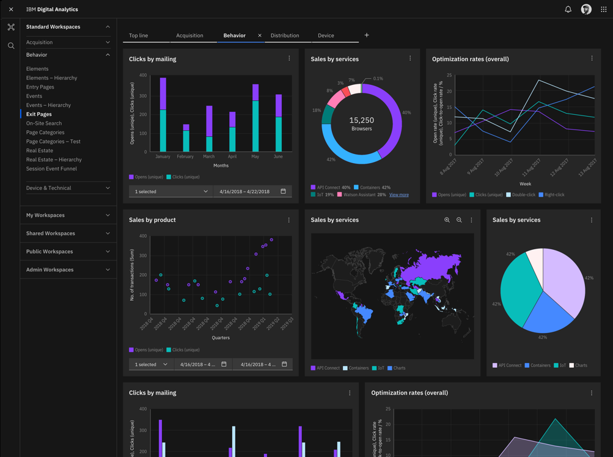

<p align="center">
	<a href="https://charts.carbondesignsystem.com/">
		
	</a>
	<h3 align="center">Carbon Charts Svelte</h3>
	<p align="center">
		A component library of 26 charts for Svelte 5.20+ and SvelteKit (optionally).
		<br /><br />
		<a href="https://www.npmjs.com/package/@carbon/charts">
			
		</a>
		
		
		<a href="https://discord.gg/J7JEUEkTRX">
	    		
	  	</a>
	</p>
</p>

## [Documentation with StackBlitz examples](https://charts.carbondesignsystem.com/)

## Maintenance & support

These Svelte components were developed by Eric Liu and Nate Stuyvesant.

Please direct all questions regarding support, bug fixes and feature requests to
[@nstuyvesant](https://github.com/nstuyvesant) and [@metonym](https://github.com/metonym).

## Getting started

Run the following command using [npm](https://www.npmjs.com/):

```bash
npm install -D @carbon/charts-svelte@next
```

If you prefer [Yarn](https://yarnpkg.com/en/), use the following command instead:

```bash
yarn add -D @carbon/charts-svelte@next
```

The required styles should be imported from `@carbon/charts-svelte/styles.css`.

## Breaking Change

This release is for Svelte 5.20+ ONLY as it uses runes mode and passing of callback functions as
properties in place of event handlers. If you need support for Svelte 3 or 4, please use the
`latest`.

### SvelteKit

While this component library can be used with any build environments for Svelte,
[SvelteKit](https://kit.svelte.dev) is the official framework for building Svelte apps supporting
client and server-side rendering (SSR). SvelteKit is powered by [Vite](https://vitejs.dev).

The module `@carbon/charts` should not be externalized for SSR when building for production.

```js
// vite.config.ts
import { sveltekit } from '@sveltejs/kit/vite'
import { defineConfig } from 'vite'

export default defineConfig({
	plugins: [sveltekit()],
	ssr: {
		noExternal: process.env.NODE_ENV === 'production' ? ['@carbon/charts'] : []
	}
})
```

#### Circular dependency warnings

You may see circular dependency warnings for `d3` packages. These can be safely ignored.

## Usage

Styles must be imported from `@carbon/charts-svelte/styles.css` or `@carbon/charts-svelte/scss`.

```js
import '@carbon/charts-svelte/styles.css'
```

### Basic

```svelte
<script>
	import '@carbon/charts-svelte/styles.css'
	import { BarChartSimple } from '@carbon/charts-svelte'
</script>

<BarChartSimple
	data={[
		{ group: 'Qty', value: 65000 },
		{ group: 'More', value: 29123 },
		{ group: 'Sold', value: 35213 },
		{ group: 'Restocking', value: 51213 },
		{ group: 'Misc', value: 16932 }
	]}
	options={{
		theme: 'g90',
		title: 'Simple bar (discrete)',
		height: '400px',
		axes: {
			left: { mapsTo: 'value' },
			bottom: { mapsTo: 'group', scaleType: 'labels' }
		}
	}} />
```

### Lifecycle callbacks

Chart components fire the following callbacks:

- **onload**: When the chart is instantiated
- **onupdate**: When `data` or `options` are updated
- **ondestroy**: When the component is unmounted and the chart is destroyed

```svelte
<BarChartSimple {data} {options} {onload} {onupdate} {ondestroy} />
```

### Dynamic import

Dynamically importing a chart within `onMount()` avoids issues with server-side rendering (SSR). The
reason `@carbon/charts-svelte` does not work with SRR is because its dependency `@carbon/charts`
expects the window object to be present for fullscreen display.

```svelte
<script>
	import '@carbon/charts-svelte/styles.css'
	import { onMount } from 'svelte'

	let Chart = $state()

	onMount(async () => {
		const charts = await import('@carbon/charts-svelte')
		Chart = charts.BarChartSimple
	})
</script>

<Chart
	data={[
		{ group: 'Qty', value: 65000 },
		{ group: 'More', value: 29123 },
		{ group: 'Sold', value: 35213 },
		{ group: 'Restocking', value: 51213 },
		{ group: 'Misc', value: 16932 }
	]}
	options={{
		theme: 'white',
		title: 'Simple bar (discrete)',
		height: '400px',
		axes: {
			left: { mapsTo: 'value' },
			bottom: { mapsTo: 'group', scaleType: 'labels' }
		}
	}} />
```

### Event listeners

In this example, an event listener is attached to the `BarChartSimple` component that fires when
hovering over a bar.

```svelte
<script>
	import '@carbon/charts-svelte/styles.css'
	import { onMount } from 'svelte'
	import { BarChartSimple } from '@carbon/charts-svelte'

	let chart = $state()

	function barMouseOver(e) {
		console.log(e.detail)
	}

	onMount(() => {
		chart.services.events.addEventListener('bar-mouseover', barMouseOver)

		return () => {
			chart?.services.events.removeEventListener('bar-mouseover', barMouseOver)
		}
	})
</script>

<BarChartSimple
	bind:chart
	data={[
		{ group: 'Qty', value: 65000 },
		{ group: 'More', value: 29123 },
		{ group: 'Sold', value: 35213 },
		{ group: 'Restocking', value: 51213 },
		{ group: 'Misc', value: 16932 }
	]}
	options={{
		title: 'Simple bar (discrete)',
		height: '400px',
		axes: {
			left: { mapsTo: 'value' },
			bottom: { mapsTo: 'group', scaleType: 'labels' }
		}
	}} />
```

### Enums and types

For your convenience, enums and types from `@carbon/charts` are re-exported from
`@carbon/charts-svelte`.

```ts
import { ScaleTypes, type BarChartOptions } from '@carbon/charts-svelte'

const options: BarChartOptions = {
	title: 'Simple bar (discrete)',
	height: '400px',
	axes: {
		left: { mapsTo: 'value' },
		bottom: {
			mapsTo: 'group',
			scaleType: ScaleTypes.LABELS
		}
	}
}
```

### Component props

Use the `ComponentProps` utility type from `svelte` to extract the props for chart components.

You can then use an
[indexed access type](https://www.typescriptlang.org/docs/handbook/2/indexed-access-types.html) to
extract types for individual properties.

```ts
import type { ComponentProps } from 'svelte'
import { BarChartSimple } from '@carbon/charts-svelte'
import { options } from './options'
import { data } from './data'

// Errors if these aren't the correct props expected by BarChartSimple
const props: ComponentProps<typeof BarChartSimple> = { options, data }
```

## <picture><source height="20" width="20" media="(prefers-color-scheme: dark)" srcset="https://raw.githubusercontent.com/ibm-telemetry/telemetry-js/main/docs/images/ibm-telemetry-dark.svg"><source height="20" width="20" media="(prefers-color-scheme: light)" srcset="https://raw.githubusercontent.com/ibm-telemetry/telemetry-js/main/docs/images/ibm-telemetry-light.svg"></picture> IBM Telemetry

This package uses IBM Telemetry to collect de-identified and anonymized metrics data. By installing
this package as a dependency you are agreeing to telemetry collection. To opt out, see
[Opting out of IBM Telemetry data collection](https://github.com/ibm-telemetry/telemetry-js/tree/main#opting-out-of-ibm-telemetry-data-collection).
For more information on the data being collected, please see the
[IBM Telemetry documentation](https://github.com/ibm-telemetry/telemetry-js/tree/main#ibm-telemetry-collection-basics).
